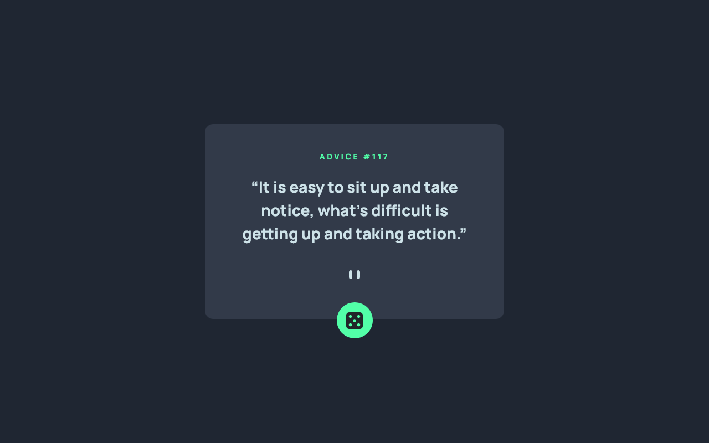

# Frontend Mentor - Advice generator app solution

This is a solution to the [Advice generator app challenge on Frontend Mentor](https://www.frontendmentor.io/challenges/advice-generator-app-QdUG-13db). Frontend Mentor challenges help you improve your coding skills by building realistic projects.

## Table of contents

-   [Overview](#overview)
    -   [The challenge](#the-challenge)
    -   [Screenshot](#screenshot)
    -   [Links](#links)
-   [My process](#my-process)
    -   [Built with](#built-with)
    -   [What I learned](#what-i-learned)
    -   [Continued development](#continued-development)
    -   [Useful resources](#useful-resources)
-   [Author](#author)

## Overview

### The challenge

Users should be able to:

-   View the optimal layout for the app depending on their device's screen size
-   See hover states for all interactive elements on the page
-   Generate a new piece of advice by clicking the dice icon

### Screenshot



### Links

-   Live Site URL: https://javieer57.github.io/advice-generator-app-main/

## My process

### Built with

-   Semantic HTML5 markup
-   CSS custom properties
-   Flexbox
-   Mobile-first workflow
-   [Bootstrap](https://getbootstrap.com/) - CSS framework
-   [Advice Slip JSON API](https://api.adviceslip.com/) - JSON API that gives out over 10 million pieces of advice.

### What I learned

The project it's based on calling an API to obtain information and insert it into the HTML document.

Previously, I made these calls with the `XMLHttpRequest()` function, but this time I worked with the `fetch()` function as it is easier to use.

When using the Firefox browser, the project didn't load the new advice (due to the browser's default caching behavior).

To fix the bug it was necessary to add the parameter `{ cache: 'reload' }` to the `fetch()` function:

```js
const adviceID = document.getElementById('adviceID');
const adviceText = document.getElementById('adviceText');

const loadAdvice = async () => {
	adviceID.innerHTML = '';
	adviceText.innerHTML = '...';

	let advice = await fetch('https://api.adviceslip.com/advice', { cache: 'reload' });

	let data = await advice.json();

	adviceID.innerHTML = data.slip.id;
	adviceText.innerHTML = `“${data.slip.advice}”`;
};
```

### Continued development

I'm currently investigating the best way to include the necessary accessibility attributes for this project. They will be added soon.

### Useful resources

-   [Referrer and cache control APIs for fetch()](https://hacks.mozilla.org/2016/03/referrer-and-cache-control-apis-for-fetch/) - This article helped me with the cache behavior of Firefox.
-   [Como Conectarse a una API con Javascript usando Async, Await y Fetch](https://www.youtube.com/watch?v=PNr8-JDMinU) - This tutorial is a basic reference for learning how to call an API.

## Author

-   Website - https://javieereufracio.com
-   Github - [@Javieer57](https://github.com/Javieer57)
-   Codepen - [@Javieer57](https://codepen.io/Javieer57)
-   Instagram - [@javieer_wd](https://www.instagram.com/javieer_wd/)
-   Frontend Mentor - [@Javieer57](https://www.frontendmentor.io/profile/Javieer57)
